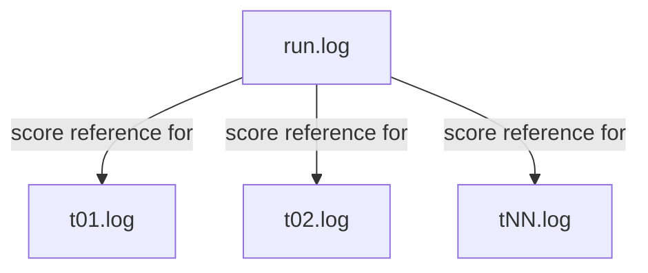

# Log Structure

Each benchmark run produces a timestamped folder and a summary log.

## Folder naming

```
<YYYYMMDD_HHMMSS>_<git-sha>[-<label>]/
```

Example: `20260410_174555_fc0743f-full-run/`

## Files



### `run.log`

Top-level summary of the run. Contains:

- Benchmark metadata (version, task count, worker count)
- One score line per task once all workers finish, e.g. `t01: 1.00`
- A final aggregate score line: `FINAL: 79.07%`
- Token usage and cost for the full run

### `tNN.log`

Detailed execution log for a single task. Contains:

- The task prompt
- Every tool call the agent made (commands, file reads, etc.) with their output
- The agent's final response / outcome

To investigate why a task scored 0.00, open the corresponding `tNN.log` alongside `run.log`.
