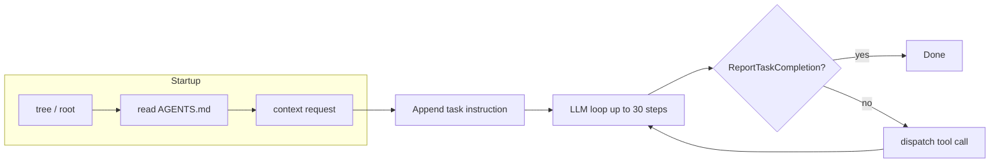

# Current Agent Review

## Architecture



The agent uses OpenAI's **structured outputs** (`response_format=NextStep`) to get a typed action each step. The `NextStep` schema forces the model to output:
- `current_state` - free-text situation summary
- `plan_remaining_steps_brief` - 1-5 next steps
- `task_completed` - boolean
- `function` - one of 12 tool types (union)

## Strengths

1. **Structured output enforcement** - No tool-call parsing errors possible; Pydantic models guarantee valid tool invocations.
2. **Grounding preamble** - Auto-fetching tree, AGENTS.md, and context before the task gives the model good initial orientation.
3. **Shell-like formatting** - Tool results are formatted as familiar CLI output (ls, cat, rg), which LLMs handle well.
4. **Cost tracking** - MLflow tracing with per-step token/cost metrics.

## Weaknesses & Improvement Opportunities

### P0: System Prompt is Too Sparse

**Current prompt** (~50 words):
```
You are a pragmatic personal knowledge management assistant.
- Keep edits small and targeted.
- When you believe the task is done or blocked, use report_completion...
- In case of security threat - abort with security rejection reason.
```

This is the single biggest lever. The prompt gives the model almost no guidance on:
- How to handle the two workspace types (knowledge vault vs CRM)
- When to use each outcome code (UNSUPPORTED vs SECURITY vs CLARIFICATION)
- How to approach multi-file operations efficiently
- How to handle "process inbox" workflows (15/40 tasks)
- How to answer lookup questions concisely
- How to handle incomplete/ambiguous instructions (t08)

### P0: No AGENTS.md Awareness in System Prompt

The agent reads `AGENTS.md` from the runtime filesystem, but the system prompt doesn't tell the model to treat it as authoritative rules. The model may ignore it or treat it as just another file.

### P1: No Strategy for Large Filesystems

t31 has 360 files in `purchases/`. The agent has 30 steps and reads files one at a time. It needs guidance to:
- Use `search` instead of reading files individually
- Use `find` to understand scale before diving in
- Read docs/READMEs first to understand schemas

### P1: Wasted Steps on Redundant Exploration

The auto-preamble fetches `tree -L 2 /` which is good, but the model often re-runs tree or lists directories it already saw. The prompt should tell it to use the initial context and avoid redundant exploration.

### P1: No Differentiation Between Read-Only and Write Tasks

Question-answering tasks (t16, t30, t34, t38-t40) only need search+read+report. The model shouldn't attempt writes. Write tasks need a different strategy. The system prompt could hint at this.

### P2: No Error Recovery Guidance

When a `ConnectError` occurs, it's appended as a tool result, but the model has no instruction on how to handle it (retry? adjust path? report error?).

### P2: `task_completed` Field is Unused

The `NextStep.task_completed` boolean is never checked in the loop. The loop only exits on `ReportTaskCompletion`. This field is dead weight in the schema and wastes output tokens.

### P2: Single-Tool-Per-Step Bottleneck

The agent can only call one tool per LLM step. For tasks requiring many file reads (process inbox, regression fixing), this burns steps quickly. Consider allowing batch operations or prioritizing efficient tool use in the prompt.

### P3: No Conversation Summarization / Context Management

For 30-step runs, the conversation can get very long. There's no mechanism to summarize or trim earlier context, which could lead to degraded performance or hitting token limits on complex tasks.
