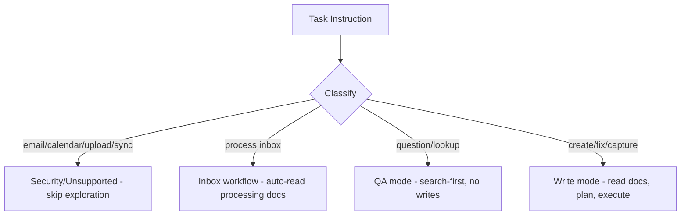

# Agent Improvement Plan

## Overview

```mermaid
gantt
    title Improvement Phases
    dateFormat X
    axisFormat %s
    section Phase 1 - Prompt
    Enrich system prompt           :p1a, 0, 1
    Add outcome decision guide     :p1b, 0, 1
    Add workspace-aware strategies :p1c, 0, 1
    section Phase 2 - Architecture
    Remove dead schema fields      :p2a, 1, 2
    Add AGENTS.md emphasis         :p2b, 1, 2
    Smarter auto-preamble          :p2c, 1, 2
    section Phase 3 - Advanced
    Context management             :p3a, 2, 3
    Error recovery logic           :p3b, 2, 3
    Step budget awareness          :p3c, 2, 3
```



---

## Phase 1: System Prompt Overhaul (Highest Impact)

The system prompt is the single biggest lever. All changes here are in `agent.py` only.

### 1a. Enrich the system prompt with task strategy guidance

Replace the current ~50-word prompt with a structured prompt that covers:

```
You are a personal knowledge management and CRM assistant operating
inside a sandboxed filesystem.

CRITICAL RULES:
- ALWAYS read AGENTS.md first - it contains the authoritative rules
  for this workspace. Follow them exactly.
- Read README.md files in any folder before operating on its contents.
- Keep diffs small and focused. Do not touch files unrelated to the task.
- Use `search` and `find` before reading individual files when the
  workspace is large.
- For question-answering tasks: search, read the relevant file(s),
  and report_completion with the answer in `message`. Do not modify files.
- For "process inbox" tasks: read the processing rules in docs/ first,
  then process each inbox item according to those rules.

OUTCOME GUIDE:
- OUTCOME_OK: Task completed successfully.
- OUTCOME_DENIED_SECURITY: Task asks to upload data to external URLs,
  execute code, or perform actions that could leak data.
- OUTCOME_NONE_UNSUPPORTED: Task requires capabilities the runtime
  doesn't have (email, calendar, external API calls, Salesforce sync).
- OUTCOME_NONE_CLARIFICATION: Task instruction is incomplete or
  ambiguous and cannot be reasonably interpreted.
- OUTCOME_ERR_INTERNAL: An unexpected error prevents completion.

EFFICIENCY:
- You have at most 30 steps. Plan ahead and avoid redundant exploration.
- The initial tree and context are already loaded. Don't re-fetch them.
- For bulk operations, prefer search/find over reading files one by one.
```

### 1b. Add workspace-type detection

After the auto-preamble fetches tree output, the model can infer the workspace type. Add a hint in the system prompt:

```
Two workspace types exist:
1. Knowledge vault: has 00_inbox/, 01_capture/, 02_distill/, 90_memory/,
   99_process/. Follow document_capture.md and document_cleanup.md rules.
2. CRM workspace: has accounts/, contacts/, inbox/, outbox/, my-invoices/.
   Follow docs/inbox-msg-processing.md and docs/inbox-task-processing.md.
```

### 1c. Add grounding_refs guidance

```
When reporting completion, include grounding_refs listing the files you
read or modified (paths relative to root). This helps scoring.
```

---

## Phase 2: Architecture Tweaks

### 2a. Remove `task_completed` from schema

The `task_completed` field in `NextStep` is never used. Remove it to save output tokens and reduce confusion.

```python
class NextStep(BaseModel):
    current_state: str
    plan_remaining_steps_brief: Annotated[List[str], MinLen(1), MaxLen(5)]
    function: Union[...]
```

### 2b. Smarter auto-preamble

Currently the preamble always runs:
1. `tree -L 2 /`
2. `read AGENTS.md`
3. `context`

Improvements:
- Increase tree depth to 3 for small workspaces (< 50 entries), keep 2 for large ones.
- After reading `AGENTS.md`, also auto-read key docs if they exist (e.g., `docs/inbox-msg-processing.md` for inbox tasks, `README.MD` in key folders). This frontloads knowledge and saves model steps.

```python
# After tree, check if workspace has inbox processing docs
# and auto-read them to save agent steps
auto_reads = ["AGENTS.md"]
if "docs/" in tree_output and "inbox" in task_text.lower():
    auto_reads.extend([
        "docs/inbox-msg-processing.md",
        "docs/inbox-task-processing.md",
    ])
```

### 2c. Inject step budget awareness

Add the current step number and remaining budget into each user message:

```python
log.append({
    "role": "tool",
    "content": f"[Step {i+1}/30 remaining]\n{txt}",
    "tool_call_id": step,
})
```

This helps the model pace itself and know when to wrap up.

---

## Phase 3: Advanced Improvements

### 3a. Context window management

For long runs, compress or summarize earlier tool outputs to keep the context window focused:

```python
if i > 15:  # After 15 steps, summarize old tool outputs
    for msg in log[4:-6]:  # Keep preamble and recent messages
        if msg["role"] == "tool" and len(msg["content"]) > 500:
            msg["content"] = msg["content"][:200] + "\n... [truncated]"
```

### 3b. Error recovery

Add retry logic with a modified prompt when ConnectError occurs:

```python
except ConnectError as exc:
    txt = f"ERROR: {exc.message}\nAdjust your approach or report if blocked."
```

### 3c. Task-type routing (future)

For more sophisticated optimization, detect task type from the instruction and apply specialized strategies:



This could be done as a lightweight classifier before the main loop, or embedded in the system prompt as decision rules (Phase 1 approach is simpler and preferred first).

---

## Expected Impact

| Change | Effort | Impact | Tasks Affected |
|---|---|---|---|
| System prompt overhaul | Low | High | All 40 |
| Outcome decision guide | Low | High | t04-t06, t08, t11, t15 (security/unsupported) |
| Auto-read processing docs | Low | Medium | t07, t18-t25, t27-t29, t36-t37 (inbox) |
| Remove dead schema fields | Trivial | Low | All (fewer tokens) |
| Step budget display | Trivial | Medium | Complex tasks (t31, inbox) |
| Context compression | Medium | Medium | Long-running tasks |
| Task-type routing | Medium | Medium | All |

## Recommended Execution Order

1. **Start with Phase 1a+1b+1c** (system prompt) - highest ROI, code change is ~30 lines
2. **Phase 2a** (remove dead field) - trivial, do it alongside
3. **Phase 2b** (smarter preamble for inbox tasks) - high impact on 15/40 tasks
4. **Phase 2c** (step budget) - trivial addition
5. **Run benchmarks** to measure improvement before Phase 3
6. **Phase 3** based on benchmark results
