# Agent Improvement Plan

## Overview

```mermaid
gantt
    title Improvement Phases
    dateFormat X
    axisFormat %s
    section Phase 1 - Prompt
    Enrich system prompt           :done, p1a, 0, 1
    Add outcome decision guide     :done, p1b, 0, 1
    Add workspace-aware strategies :done, p1c, 0, 1
    section Phase 2 - Architecture
    Remove dead schema fields      :done, p2a, 1, 2
    Smarter auto-preamble          :done, p2b, 1, 2
    Step budget awareness          :done, p2c, 1, 2
    Adaptive doc pre-reading       :done, p2d, 1, 2
    section Phase 3 - Robustness
    Context compression            :done, p3a, 2, 3
    LengthFinishReason handling    :done, p3b, 2, 3
    Schema verbosity constraints   :done, p3c, 2, 3
```

---

## Phase 1: System Prompt Overhaul — IMPLEMENTED

Replaced the ~50-word prompt with a structured ~2200-char prompt covering:

- **Capability boundaries**: Explicit list of what the runtime CAN and CANNOT do (no email, HTTP, calendars, external services). This enables fast rejection of unsupported tasks.
- **Outcome decision guide**: Clear rules for choosing between OK, SECURITY, UNSUPPORTED, CLARIFICATION, and INTERNAL outcomes. Generic enough for unseen task types.
- **Workflow rules**: AGENTS.md treated as authoritative, README.md in folders read before operating, diffs kept focused.
- **Efficiency guidance**: Step budget awareness, avoid re-fetching tree, use search/find for lookups, plan ahead past step 20.
- **Error handling**: Read error messages, adjust approach, don't blindly retry.
- **Grounding refs**: Guidance to include file paths in completion reports.

Design principle: The prompt describes *general capabilities and constraints* rather than hardcoding specific task types. New task types should be handled correctly because the prompt teaches the model *how to think* about tasks, not *what specific tasks exist*.

## Phase 2: Architecture Tweaks — IMPLEMENTED

### 2a. Removed `task_completed` from NextStep schema
The boolean was never checked in the agent loop. Removing it saves output tokens per step and reduces schema noise.

### 2b. Smarter auto-preamble with adaptive doc reading
The preamble now:
1. Fetches tree at **depth 3** (was 2) for better filesystem visibility.
2. Handles AGENTS.md / AGENTS.MD casing fallback.
3. **Parses the tree result** to detect available docs and auto-reads them based on:
   - Processing/workflow/inbox docs — read when task mentions "inbox" or "process"
   - README.md in operational subfolders (up to 3) — always read
   - `soul.md` / `agent_preferences.md` — always read if present
   - Channel docs — read when task mentions channels/telegram/discord/blacklist

This saves 2-5 agent steps on inbox-processing tasks (15/40 observed tasks) by frontloading the rules the model would otherwise spend steps discovering.

### 2c. Step budget injection
Each tool result now includes `[step N/30, M remaining]`. When only 5 steps remain, the message adds `— wrap up soon: report_completion if possible`. This helps the model pace itself on complex tasks.

### 2d. Improved error messages
ConnectError results now include actionable guidance: `"Adjust your approach or report if blocked."` instead of a raw error string.

### File structure cleanup
Moved `collect_tasks.py` to `scripts/` to keep the top-level focused on core runtime files. Makefile updated accordingly.

## Phase 3: Robustness & Context Management — IMPLEMENTED

### 3a. Context compression (`_compress_log`)

**Problem**: Over 30 steps, the conversation grows with full file contents from every `read`, `search`, and `tree` call. This wastes prompt tokens (and cost) on information the model already processed.

**Solution**: Before each LLM call, `_compress_log()` trims tool-result messages that are:
- Older than the 6 most recent tool results (configurable via `_KEEP_RECENT`)
- Longer than 800 chars (configurable via `_TOOL_TRIM_CHARS`)

Trimmed messages keep their first 6 lines (including the step budget note) and last 3 lines, with a `[trimmed N lines]` marker in between. The preamble (system prompt, auto-read docs, task instruction) is never touched.

This typically reduces prompt size by 30-50% on long-running tasks while preserving the model's ability to reference recent context.

### 3b. LengthFinishReasonError handling

**Problem**: The model sometimes generates massive structured output (e.g., writing a large file or producing a very verbose `current_state`), hitting the 16384 `max_completion_tokens` limit. This caused `LengthFinishReasonError` crashes that killed entire task runs.

**Solution**: Two-layer recovery:
1. On first `LengthFinishReasonError`, inject a conciseness nudge (`"Be much more concise..."`) and retry once.
2. If the retry also hits the limit, skip the step and continue (the step counter still advances, so the agent eventually reaches the budget limit).
3. The conciseness nudge is removed from the log after use to avoid polluting future context.

### 3c. Schema verbosity constraints

Added `description` hints to `NextStep.current_state` (`"1-2 sentence summary — do not repeat file contents"`) and `plan_remaining_steps_brief` (`"one short phrase each"`). These guide the model to produce compact structured output, reducing the chance of hitting token limits in the first place.

---

## Future Improvements

| Idea | When | Rationale |
|---|---|---|
| Task-type pre-routing | If benchmarks show wasted steps on obvious unsupported tasks | Classify instruction before entering the loop; immediately report unsupported |
| Adaptive `max_completion_tokens` | If some tasks need larger writes | Increase limit for write-heavy tasks, decrease for QA tasks |
| Multi-model routing | If cost is a concern | Use a smaller model for simple QA tasks, larger model for complex workflows |
