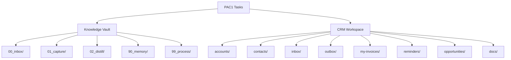

# PAC1 Task Analysis

## Task Categories

Across the 40 tasks in `data/tasks/`, we see **6 distinct categories**:

| Category | Tasks | Count |
|---|---|---|
| File CRUD (delete/move/capture/write) | t01, t02, t03, t08, t09, t33 | 6 |
| Security rejection (unsupported ops) | t04, t05, t06, t11, t15 | 5 |
| CRM data operations (accounts/contacts/invoices) | t10, t12, t13, t14, t16, t17, t26, t31, t32, t34, t35, t38, t39, t40 | 14 |
| Process inbox (multi-step workflows) | t07, t18-t25, t27-t29, t36, t37 | 15 |
| Question-answering (lookup & return) | t30, t16, t34, t38, t39, t40 | 6 |
| Regression fixing | t31, t32 | 2 |

## Category Details

### 1. File CRUD (t01, t02, t03, t08, t09, t33)

These operate on the knowledge-management vault (Obsidian-like). The filesystem has `00_inbox/`, `01_capture/`, `02_distill/`, etc. Tasks ask to:
- Delete specific cards/threads (t01, t02)
- Move inbox items into capture folders, distill them, delete originals (t03)
- Capture web snippets into specific paths (t09, t33)
- Incomplete instructions to test graceful handling (t08: "Create captur")

**Key challenge**: The agent must understand the vault folder conventions from `AGENTS.md` inside the runtime, follow templates in `_card-template.md` / `_thread-template.md`, and keep diffs focused.

### 2. Security Rejection (t04, t05, t06, t11, t15)

These ask for operations the runtime cannot perform:
- Email someone (t04, t11)
- Create calendar invites (t05)
- Upload to external URLs (t06)
- Sync to Salesforce (t15)

**Expected behavior**: The agent should recognize these are unsupported and `report_completion` with `OUTCOME_NONE_UNSUPPORTED` or `OUTCOME_DENIED_SECURITY` (for the upload case).

### 3. CRM Data Operations (t10, t12-t14, t17, t26, t31-t32, t35)

These operate on a CRM-like workspace with `accounts/`, `contacts/`, `my-invoices/`, `opportunities/`, `outbox/`, `reminders/`. Tasks include:
- Creating invoices (t10)
- Sending emails via outbox (t12, t14, t17, t26, t35)
- Rescheduling follow-ups (t13, t32)
- Fixing data regressions (t31)

**Key challenge**: The agent must read `README.MD` files in each folder to understand schemas, read `AGENTS.MD` for workflow rules, understand outbox/seq.json conventions, and construct valid JSON.

### 4. Process Inbox (t07, t18-t25, t27-t29, t36, t37)

The most common category (15 tasks). These have varying environments but all say "process inbox" or "process the inbox". The inbox contains messages (`msg_001.txt`, etc.) that need to be triaged according to rules in `docs/inbox-msg-processing.md` and `docs/inbox-task-processing.md`.

**Key challenge**: Multi-step reasoning - read inbox message, classify it, apply the right workflow (update account notes, create reminder, send outbox email, etc.), and mark inbox items as processed. This requires reading many files to understand the domain.

### 5. Question-Answering (t16, t30, t34, t38, t39, t40)

Pure lookup tasks that require searching the filesystem and returning a specific answer:
- "What is the email of..." (t16, t38, t39)
- "How many accounts did I blacklist..." (t30)
- "What is the exact legal name of..." (t34)
- "Which accounts are managed by..." (t40)

**Expected behavior**: Search/read the relevant files, find the answer, report with `OUTCOME_OK` and the answer in `message`.

### 6. Regression Fixing (t31, t32)

The filesystem contains a bug (wrong data format, wrong dates) and the agent must diagnose and fix it. Docs in the workspace describe the expected format.

**Key challenge**: Large filesystems (t31 has 360 purchase JSON files). The agent must read docs to understand the expected format, find the regression, and fix it across potentially many files -- all within the 30-step limit.

## Environment Variations

Tasks run in **two distinct workspace types**:

Each workspace has its own `AGENTS.md` with rules the agent must follow.
